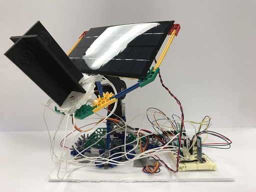
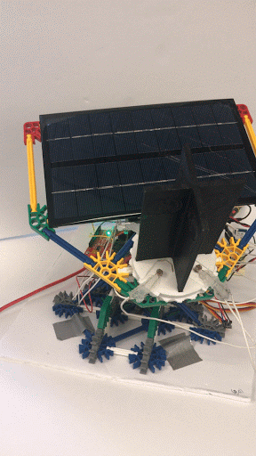
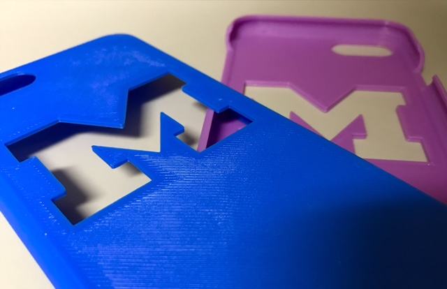
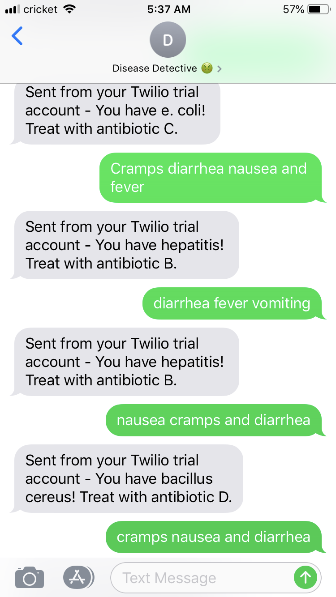

# Jerry Liu

I am a sophomore majoring in Electrical Engineering with a minor in entrepreneurship at the University of Michigan. Some of my previous projects were related to robotics, embedded systems, and machine learning. I am currently interested in studying embedded systems, but I am also eager to learn more about almost anything. :grin:

## Education
University of Michigan, B.S.E in Electrical Engineering

## Projects

### Dual Axis Solar Tracker Fall 2017

I made a dual axis solar tracker using Arduino components. Our team 3D printed a cross to use shadows as a way to track light by placing four photodiodes in each section of the cross. If the difference in light received from the photodiodes exceeds a threshold, the horizontal axis or vertical axis servo would spin in the appropriate direction. I specifically worked on power optimization. Instead of incrementing the servo movement 3 degrees every loop, I changed the code to move proportional to the difference in light. The farther the solar tracker was from light, the farther the solar tracker would move. 

| Before Power Optimization | After Power Optimization |
| --- | --- |
 | 

### 3D Printed Phone Case Startup Spring 2017

For my entrepreneurship class project, we were encouraged to use simple everyday materials to create a product or service to sell. With limited materials, I had the idea of 3D printing and selling phone cases. We named our startup CAS3D, and we began designing our own phone cases on Autodesk Fusion 360. I experimented with the durability of the phone case by extruding material to make them more flexible. I messed around with different designs and colors. For example, below is a link to my GrabCAD account where I designed a two piece phone case that could act as a phone stand as well. I stopped the phone case venture after analyzing our profit margin. Since we were using the school's provided 3D printer, we could only print a few phone cases a day. Our max profit per day was around $10 since we sold each phone case at $5. Margin for expansion was also limited.

[Jerry Liu GrabCAD](https://grabcad.com/jerry.liu-11)

### Mars Rover Motor Controller Fall 2018

To reduce the weight and bulkiness of motor controllers on our mars rover, my subteam was tasked with designing motor controller circuits and printing them on fabricated circuit boards. Currently, we use Talon SRX motor controllers which contain a variety of built in features. My idea was to build a simple motor driver that could control the speed and direction of the motors first and then add functionality. Once a working circuit was built, we could scrap the extra components, design the circuit on Altium, and send it for fabrication. The project is a work in progress. Right now, our motor driver circuit can drive a motor forward, reverse, and brake.

### Machine Learning Disease Diagnoser Fall 2018

With limited coding experience, my team and I participated at MHACKS 2018 with the goal of studying machine learning. We began with tutorials on Tensorflow like MNIST and fashion MNIST. I had the idea of creating a program that could diagnose diseases based off given symptoms. We used a Twilio API to program a chatbot that prompted users for symptoms. The program would then run a python file written using Tensorflow and Keras to run a basic classification model trained on data in CSV files. We focused on 4 diseases and 16 symptoms of foodborne illnesses. The program outputted the probability of each of the four diseases based off the given symptoms, and then returned to the user the highest probability disease and the associated treatment. Our evaluation accuracy after modifying different parameters--number of layers and nodes--ended up at 50%. 
